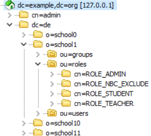

# ldap-test-tools

1. [Generate user data as LDIF](#generate-user-data-as-ldif)
2. [Startup with docker-compose](#startup-with-docker-compose)
3. [Build a container with pre-filled database](#build-a-container-with-pre-filled-database)

## Generate user data as LDIF

Data in LDIF format can be used to seed an LDAP server.

`npm i && node generateLdif.js`

This prints the LDIF directly to stdout. Run `node generateLdif.js > export.ldif` to pipe it into a file.

```
node generateLdif.js --help
  Usage: generateLdif.js [options] [command]

  Commands:
    help     Display help
    version  Display version

  Options:
    --basePath [value]     The LDAP base path used in the directory (defaults to "dc=example, dc=org")
    --help                 Output usage information
    --numberOfClasses <n>  the number of classes to create (per school) (defaults to 100)
    --numberOfSchools <n>  The number of schools to create (defaults to 20)
    --numberOfUsers <n>    The number of users to create (per school) (defaults to 1000)
    --version              Output the version number
```

### Export structure

The LDAP entities are compatible with the `general`, `iserv`, and `iserv-idm` providers used by the schulcloud-server.
The basic structure looks like this:



On the base path level, the script will create a container `dc=de`, which contains all schools. This emulates the domain handling of the central IServ. When connecting to a server seeded with this data using the `general` or `iserv` strategies, instead of `dc=example,dc=org`, use `o=school0,dc=de,dc=example,dc=org` as base path, to isolate a specific school.

Each school has all users organized in the `ou=users` directory. `ou=roles` contains the four roles `ROLE_ADMIN`, `ROLE_TEACHER`, `ROLE_STUDENT` (does not exist in `iserv` and `iserv-idm`, but is necessary for `general`), and `ROLE_NBC_EXCLUDE` (users who should not be synced). `ou=groups` contains classes, which are constructed with random users (teachers, students, excluded users).

### Seeding a server

The data can be used as-is with a server that already has the configured base path nodes. All other nodes will be created in the import process and must not be present.
To successfully import uuids, the [uuid schema](./schema/uuid.schema) must be imported before importing the generated LDIF. For `memberOf` (required for roles via group membership), the [memberOf overlay](https://www.adimian.com/blog/2014/10/how-to-enable-memberof-using-openldap/) must be active for the `member` attribute on `groupOfNames` nodes on the server before importing the groups.

### Creating an LDAP configuration

To connect to the server seeded with that exported data, use one of these templates. Use [this tool](https://docs.hpi-schul-cloud.org/pages/viewpage.action?pageId=132680090) to encrypt the search user password.

Remember to adapt the base path to your chosen base and replace the URL and port. Don't use `ldaps://` with a self-signed certificate.

**iserv-idm**
```json
{
    "type" : "ldap",
    "alias" : "Fake-IServ",
    "ldapConfig" : {
        "provider" : "iserv-idm",
        "url" : "ldap://127.0.0.1:389",
        "rootPath" : "dc=example,dc=org",
        "searchUser" : "cn=admin,dc=example,dc=org",
        "searchUserPassword" : "U2FsdGVkX18OoIinJA2yeskAPGLFqcb0ArdCNoouRrY=",
        "active" : true
    }
}
```

**general**
```json
{
	"ldapConfig": {
		"active": true,
		"url": "ldap://127.0.0.1:389",
		"rootPath": "o=school0,dc=de,dc=example,dc=org",
		"searchUser": "cn=admin,dc=example,dc=org",
		"searchUserPassword": "U2FsdGVkX18OoIinJA2yeskAPGLFqcb0ArdCNoouRrY=",
		"provider": "general",
		"providerOptions": {
			"schoolName": "Generated School 0",
			"userPathAdditions": "ou=users",
			"classPathAdditions": "ou=groups",
			"roleType": "group",
			"userAttributeNameMapping": {
				"givenName": "givenName",
				"sn": "sn",
				"dn": "dn",
				"uuid": "uuid",
				"uid": "uid",
				"mail": "mail",
				"role": "description"
			},
			"roleAttributeNameMapping": {
				"roleStudent": "cn=ROLE_STUDENT,ou=roles,o=school0,dc=de,dc=example,dc=org",
				"roleTeacher": "cn=ROLE_TEACHER,ou=roles,o=school0,dc=de,dc=example,dc=org",
				"roleAdmin": "cn=ROLE_ADMIN,ou=roles,o=school0,dc=de,dc=example,dc=org",
				"roleNoSc": "cn=ROLE_NBC_EXCLUDE,ou=roles,o=school0,dc=de,dc=example,dc=org"
			},
			"classAttributeNameMapping": {
				"description": "cn",
				"dn": "dn",
				"uniqueMember": "member"
			}
		}
	},
	"type": "ldap",
	"alias": "LDAP Integration",
}
```

Add these documents to the systems collection and [trigger an LDAP sync](https://docs.hpi-schul-cloud.org/display/TSC/LDAP+Integration).


## Startup with docker-compose

> Startup of the docker container can take a while, because of the amount of data it has to write to the database

Run `docker-compose up -d` to startup a OpenLDAP server with sample data to use with Schulcloud-Server.
The docker-compose file also sets up a phpLDAPAdmin which is reachable via `http://localhost:8080`.

To Login use as user `cn=admin,dn=example,dn=org`, default password is `admin`
The LDAP container is reachable via port `389`and `636`.

## Build a container with pre-filled database

Run `docker build -t myopenldap .` to create a new docker image with pre-filled data. This saves time at startup, but already runs the first steps like set of the admin password, so they cannot be changed later.

The default admin password is `Schulcloud1!`. To change it, run the build command with arg `LDAP_ADMIN_PASSWORD`: `docker build --build-arg LDAP_ADMIN_PASSWORD=Donky -t myopenldap .`
